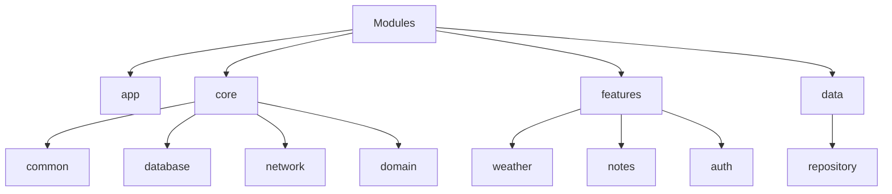

Architecture tree:

```mermaid
graph TD
    M[Modules] --> app
    M --> core
    M --> features
    M --> d[data]
    
    core --> common
    core --> db[database]
    core --> net[network]
    core --> domain
    
    features --> w[weather]
    features --> n[notes]
    features --> auth
    
    d --> repos[repository]
```
