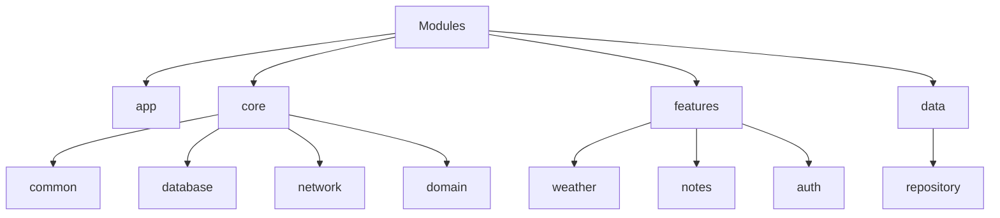
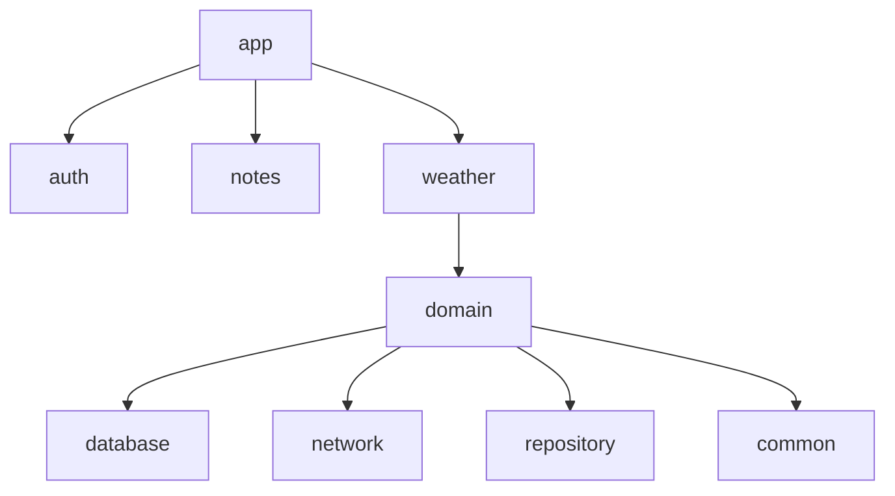

Main idea: 
The app performs the function of getting weather from the standard Web API(OpenWeatherMap), as well as saving messages with the ability to insert the current weather.
The database is based on SQLLite. 
Jetpack Compoce is used to display the UI.

Architecture tree:

Module dependencies:

